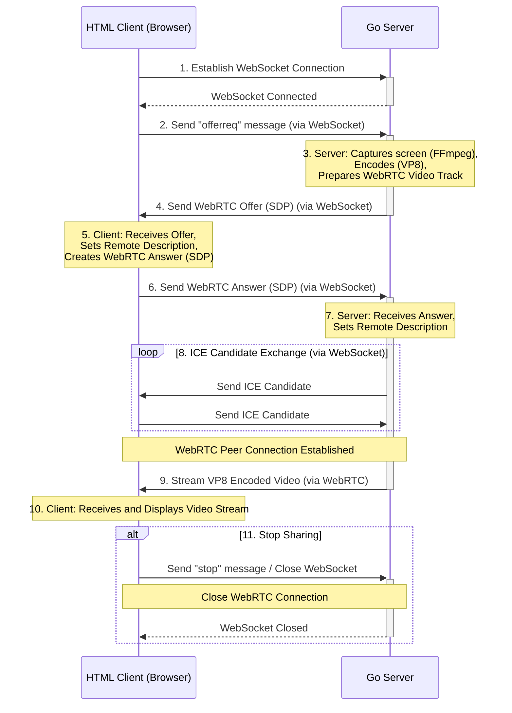

# WebRTC Screen Sharing Design Document

## 1. Introduction

This document outlines the design and implementation of a simple WebRTC screen sharing application. The application consists of a Go-based server that captures the screen of a virtual machine (VM) and an HTML page with a video player that displays the streamed content. This project is designed to be educational, providing students with a practical understanding of WebRTC and video streaming concepts.

## 2. Goals

*   Provide a basic, functional screen sharing application using WebRTC.
*   Offer clear, well-commented code for educational purposes.
*   Explain the core concepts of WebRTC signaling, media streaming, and peer-to-peer communication.
*   Demonstrate how to integrate FFmpeg for screen capture and video encoding.

## 3. Architecture

The application follows a client-server architecture, with the server capturing and streaming the screen, and the client displaying the stream. WebRTC is used for peer-to-peer media streaming, while WebSockets facilitate signaling between the client and server.

### 3.1. Components

*   **Go Server (main.go):**
    *   Handles WebSocket connections for signaling.
    *   Creates and manages WebRTC peer connections.
    *   Captures the screen using FFmpeg.
    *   Encodes the captured screen into VP8 video.
    *   Streams the encoded video to the client via WebRTC.
*   **HTML Client (index.html):**
    *   Establishes a WebSocket connection to the server.
    *   Handles WebRTC signaling to establish a peer connection.
    *   Receives and displays the video stream from the server.

## 3.2. Data Flow

1.  The client (browser) opens a WebSocket connection to the Go server. [https://developer.mozilla.org/en-US/docs/Web/API/WebSocket]
2.  The client sends an "offerreq" message to the server, requesting a WebRTC offer.  [https://developer.mozilla.org/en-US/docs/Web/API/WebRTC_API/Signaling_and_video_calling]
3.  The server captures the screen using FFmpeg, encodes it into VP8, and prepares a WebRTC video track.  [https://ffmpeg.org/documentation.html]
4.  The server creates a WebRTC offer (SDP) and sends it to the client via the WebSocket connection.  [https://datatracker.ietf.org/doc/html/rfc4566]
5.  The client receives the offer, sets it as the remote description, and creates a WebRTC answer (SDP). [https://developer.mozilla.org/en-US/docs/Web/API/RTCPeerConnection/setRemoteDescription]
6.  The client sets the answer as the local description and sends it back to the server via the WebSocket connection. [https://developer.mozilla.org/en-US/docs/Web/API/RTCPeerConnection/setLocalDescription]
7.  The server receives the answer and sets it as the remote description. [https://developer.mozilla.org/en-US/docs/Web/API/RTCPeerConnection/setRemoteDescription]
8.  ICE (Internet Connectivity Establishment) candidate exchange occurs between the client and server via the WebSocket connection. ICE candidates are potential network addresses that peers can use to connect. [https://datatracker.ietf.org/doc/html/rfc8445]
9.  Once the ICE candidates are exchanged and a peer connection is established, the server streams the VP8 encoded video frames to the client via WebRTC. [https://webrtc.org/]
10. The client receives the video stream and displays it in the `<video>` element. [https://developer.mozilla.org/en-US/docs/Web/HTML/Element/video]
11. The client can stop the screen sharing by clicking the "Stop" button, which closes the WebSocket and WebRTC connections.

### 3.3. Communication Flow Diagram

The following diagram illustrates the sequence of interactions between the HTML client and the Go server:




## 4. Technologies

*   **Go:**  The server-side logic is implemented in Go, chosen for its concurrency features and networking capabilities.
    *   [Go Programming Language](https://go.dev/)
*   **WebRTC:**  Web Real-Time Communication provides peer-to-peer media streaming capabilities.
    *   [WebRTC Overview](https://webrtc.org/):  Official WebRTC project site.
*   **WebSockets:**  WebSockets provide a persistent, full-duplex communication channel between the client and server for signaling.
    *   [WebSockets RFC 6455](https://datatracker.ietf.org/doc/html/rfc6455):  The official RFC for the WebSocket protocol.
*   **FFmpeg:**  FFmpeg is used for screen capture and video encoding.
    *   [FFmpeg Documentation](https://ffmpeg.org/documentation.html): Official FFmpeg documentation.
*   **HTML/JavaScript:**  The client-side user interface is built with HTML and JavaScript.
*   **Pion WebRTC:** A Go implementation of the WebRTC API. [https://github.com/pion/webrtc/v4]
*   **gorilla/websocket:** A Go library for WebSocket communication. [https://github.com/gorilla/websocket]

## 5. Implementation Details

### 5.1. Go Server (main.go)

*   **WebSocket Handling:** The `handleWebSocket` function upgrades HTTP connections to WebSocket connections and handles incoming messages from the client.
    *   [Gorilla WebSocket Examples](https://github.com/gorilla/websocket/tree/master/examples): Examples of using the `gorilla/websocket` library.
*   **WebRTC Peer Connection:** The `webrtc.PeerConnection` object is used to establish a peer-to-peer connection with the client.
    *   [Pion PeerConnection API](https://pkg.go.dev/github.com/pion/webrtc/v4#PeerConnection): Pion's `PeerConnection` API documentation.
*   **SDP Negotiation:** The `handleSignalingMessage` function handles SDP offer/answer exchange to negotiate media capabilities.
    *   [SDP (Session Description Protocol) RFC 4566](https://datatracker.ietf.org/doc/html/rfc4566):  The RFC for SDP.
*   **ICE Candidate Exchange:**  The server collects ICE candidates and sends them to the client, and also receives ICE candidates from the client.
    *   [ICE (Interactive Connectivity Establishment) RFC 8445](https://datatracker.ietf.org/doc/html/rfc8445): The RFC for ICE.
*   **Screen Capture with FFmpeg:** The `captureAndStream` function uses FFmpeg to capture the screen and encode it into VP8 video. The encoded video is then streamed to the WebRTC video track.
    *   [FFmpeg gdigrab (Windows)](https://ffmpeg.org/ffmpeg-devices.html#gdigrab): Documentation for `gdigrab` screen capture on Windows.
    *   [FFmpeg x11grab (Linux)](https://ffmpeg.org/ffmpeg-devices.html#x11grab): Documentation for `x11grab` screen capture on Linux.
    *   [FFmpeg avfoundation (macOS)](https://ffmpeg.org/ffmpeg-devices.html#avfoundation): Documentation for `avfoundation` screen capture on macOS.
*   **Error Handling:** The code includes error handling to gracefully handle potential issues during WebSocket communication, WebRTC peer connection establishment, and screen capture.

### 5.2. HTML Client (index.html)

*   **WebSocket Connection:**  The JavaScript code establishes a WebSocket connection to the Go server.
    *   [WebSocket API - MDN](https://developer.mozilla.org/en-US/docs/Web/API/WebSocket):  Mozilla Developer Network documentation on the WebSocket API.
*   **WebRTC Signaling:** The client sends an "offerreq" message to the server to initiate the WebRTC connection. It then handles the SDP offer/answer exchange and ICE candidate exchange.
    *   [WebRTC Signaling - MDN](https://developer.mozilla.org/en-US/docs/Web/API/WebRTC_API/Signaling_and_video_calling): MDN documentation on WebRTC signaling.
*   **Media Stream Handling:** The `ontrack` event handler is used to receive the video stream from the server and display it in the `<video>` element.
    *   [WebRTC Media Streams - MDN](https://developer.mozilla.org/en-US/docs/Web/API/MediaStream): MDN documentation on Media Streams.
*   **UI Controls:** The "Start" and "Stop" buttons are used to control the screen sharing process.
*   **STUN Server:** The client uses a STUN server (`stun:stun.l.google.com:19302`) to discover its public IP address, which is needed for establishing a WebRTC connection.
    *   [STUN Protocol RFC 5389](https://datatracker.ietf.org/doc/html/rfc5389): The RFC for STUN.

## 6. Codec

*   **VP8:** The application uses VP8 as the video codec [https://www.webmproject.org/vp8/]. VP8 is a royalty-free video compression format suitable for WebRTC. The FFmpeg command in the go server specifies `-c:v libvpx` to enforce the usage of the VP8 codec.
    *   [libvpx](https://www.webmproject.org/code/): Information about libvpx, the VP8/VP9 encoder/decoder.

## 7. Dependencies

*   **Go:** Ensure you have Go installed and configured on your system. [https://go.dev/doc/install]
*   **FFmpeg:**  Install FFmpeg on your system and ensure it is in your system's PATH.  On Windows, you might need to configure `gdigrab`. [https://ffmpeg.org/download.html]
*   **WebRTC Libraries:** Use `go get` to download the necessary WebRTC libraries (`github.com/pion/webrtc/v4`, `github.com/pion/webrtc/v4/pkg/media`, `github.com/gorilla/websocket`).

## 8. Usage

1.  **Install Dependencies:** Make sure you have Go, FFmpeg, and the required Go packages installed.
2.  **Run the Go Server:**
    ```bash
    go run main.go
    ```
3.  **Open the HTML Page:** Open `index.html` in a web browser.
4.  **Start Screen Sharing:** Click the "Start" button.  The browser might prompt you for camera/microphone access, even though this application only shares the screen. This is a WebRTC security feature.
5.  **View the Stream:** The video stream from the server's screen should appear in the video player.
6.  **Stop Screen Sharing:** Click the "Stop" button to terminate the connection.

## 9. Potential Improvements

*   **STUN/TURN Servers:**  Implement STUN/TURN server configuration for better connectivity in different network environments.
    *   [TURN Protocol RFC 5766](https://datatracker.ietf.org/doc/html/rfc5766): The RFC for TURN.
*   **Error Handling:** Improve error handling and logging for more robust operation.
*   **Adaptive Bitrate Streaming:** Implement adaptive bitrate streaming to adjust the video quality based on network conditions.
    *   [WebRTC Adaptive Bitrate Control](https://webrtcstandards.info/webrtc-nv-adaptive-bitrate-control/): Information about adaptive bitrate control in WebRTC.
*   **Codec Negotiation:** Implement more sophisticated codec negotiation to support different video codecs.
*   **Cross-Platform Support:**  Adapt the FFmpeg command for screen capture to support other operating systems (e.g., Linux, macOS).  The `gdigrab` option is specific to Windows.  Linux uses `x11grab`, and macOS uses `avfoundation`.
*   **Security:** Implement proper security measures, such as authentication and encryption, for production environments.
    *   [DTLS (Datagram Transport Layer Security) RFC 6347](https://datatracker.ietf.org/doc/html/rfc6347): The RFC for DTLS, which is used to encrypt WebRTC media streams.
*   **User Interface:** Create a more user-friendly interface with controls for video quality, screen selection, and other options.

## 10. Learning Resources
*   **WebRTC Tutorials**:
    *   [WebRTC.ventures Blog](https://webrtc.ventures/blog/): A blog with many WebRTC tutorials.
    *   [MDN WebRTC API](https://developer.mozilla.org/en-US/docs/Web/API/WebRTC_API): Mozilla Developer Network's WebRTC API documentation.
*   **WebRTC Signaling**:
    *   [High Performance Browser Networking - WebRTC Signaling](https://hpbn.co/signaling/):  Excellent explanation of WebRTC signaling process.
*   **FFmpeg Screen Capture**:
    *   [FFmpeg Wiki](https://trac.ffmpeg.org/wiki): The official FFmpeg wiki.
*   **VP8 Codec**:
    *   [VP8 - A Data Compression Technology for the Web](https://www.ietf.org/archive/id/draft-grange-vp8-00.txt): VP8 Data Compression Details

## 11. Conclusion

This project provides a basic framework for understanding WebRTC screen sharing. By studying the code and following the instructions, students can gain valuable insights into the core concepts of WebRTC and video streaming. This design document serves as a guide for understanding the application's architecture, implementation, and potential areas for improvement.